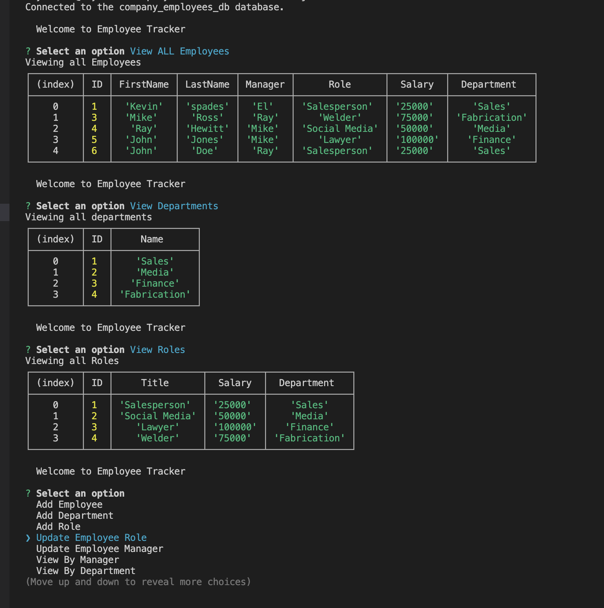

# Employee-Tracker
	
## Description
 This awesome CLI App can keep track of all your employees no mater if they get promoted,changed position or even left the company all that can be handled here. 

## Installation
 Fork the repository from GitHub. Open the terminal at the forked repository. Type in the terminal npm install. then node index.js to start the app.

## Usage
 https://drive.google.com/file/d/1y-ZI74zAeCBSRb6u_ycucqh9F4VNouT5/view?usp=sharing
 
 

## Credits
Penn Boot Camp

## License
MIT License

Copyright (c) 2022
    
Permission is hereby granted, free of charge, to any person obtaining a copy
of this software and associated documentation files (the "Software"), to deal
in the Software without restriction, including without limitation the rights
to use, copy, modify, merge, publish, distribute, sublicense, and/or sell
copies of the Software, and to permit persons to whom the Software is
furnished to do so, subject to the following conditions:
   
The above copyright notice and this permission notice shall be included in all
copies or substantial portions of the Software.
    
THE SOFTWARE IS PROVIDED "AS IS", WITHOUT WARRANTY OF ANY KIND, EXPRESS OR
IMPLIED, INCLUDING BUT NOT LIMITED TO THE WARRANTIES OF MERCHANTABILITY,
FITNESS FOR A PARTICULAR PURPOSE AND NONINFRINGEMENT. IN NO EVENT SHALL THE
AUTHORS OR COPYRIGHT HOLDERS BE LIABLE FOR ANY CLAIM, DAMAGES OR OTHER
LIABILITY, WHETHER IN AN ACTION OF CONTRACT, TORT OR OTHERWISE, ARISING FROM,
OUT OF OR IN CONNECTION WITH THE SOFTWARE OR THE USE OR OTHER DEALINGS IN THE
SOFTWARE.

## Badges

## Features
 - Show/Add/Update/Delete employees
 - Show all roles and departments
 - Stores the Employees/Roles/Departmentsin a MySQL database
 
## How to Contribute
https://github.com/Rayman244/Employee-Tracker

## Questions
 Message me on Github https://github.com/Rayman244/
 email me at [rayhewitt42@icloud.com](mailto:rayhewitt42@icloud.com)